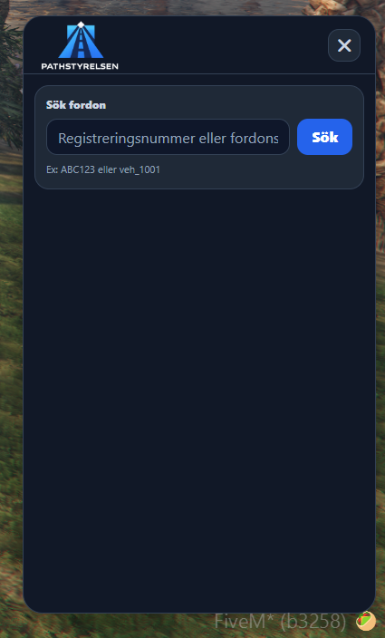
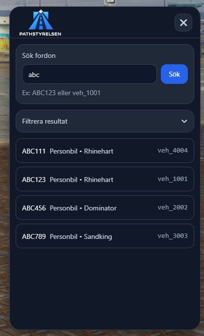
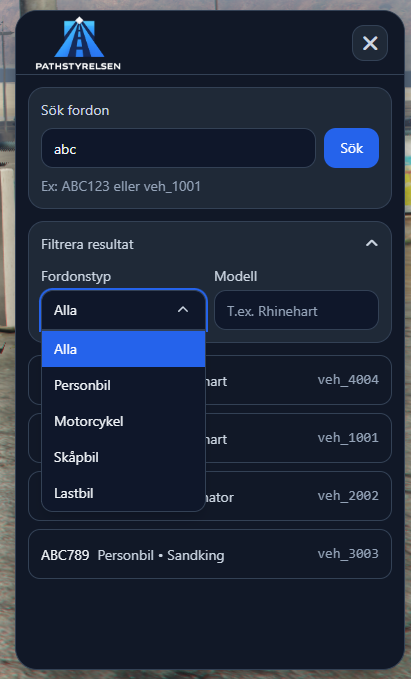
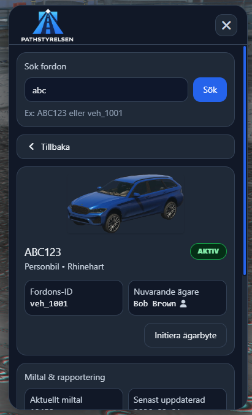
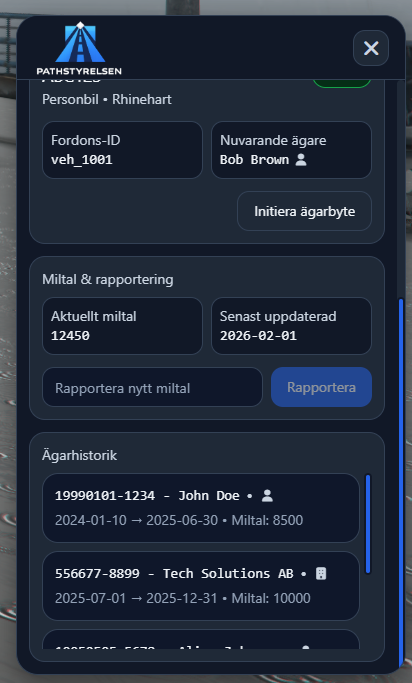
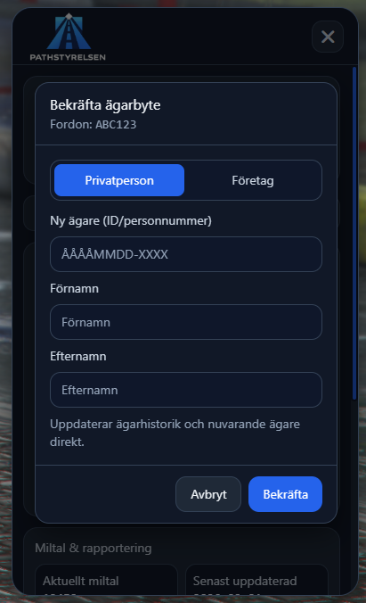
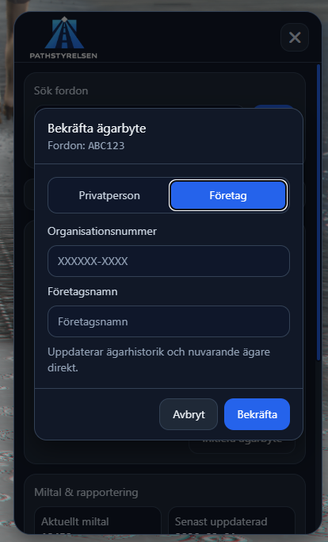

# Pathstyrelsen

A FiveM script for vehicle registry, ownership history, and mileage reporting.

## Features

- Search vehicles by registration number or vehicle ID
- Display vehicle type, model, status, current owner, and mileage
- Ownership history with date intervals and visual marking of current owner
- Initiate ownership transfer and report new mileage directly in the UI
- Dynamic and clear result view

## Installation

1. Clone the repo and place the folder in your resources directory.
2. Run `npm install` in the `ui` folder.
3. Start the resource in your server.cfg:
   ```
   ensure pathstyrelsen
   ```

## Configuration

- Edit vehicles and owners in `server/server.lua`.
- Build the UI with `npm run build` in the `ui` folder.

## NOTE

This is only a test script so no connection to actual database.

## Support

Questions? Send a PM or create an issue on GitHub.

## Screenshots

### Home



### Vehicle Search



### Search Filter



### Vehicle Information



### Mileage & Ownership History



### Transfer Owner Modal



